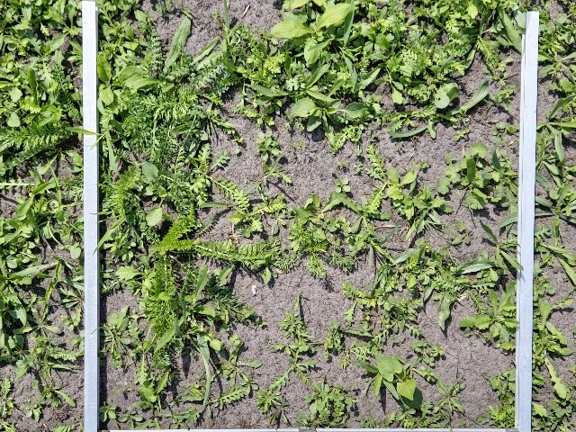
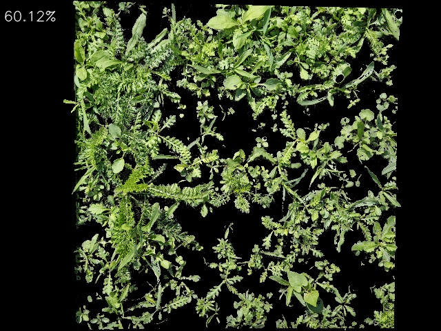
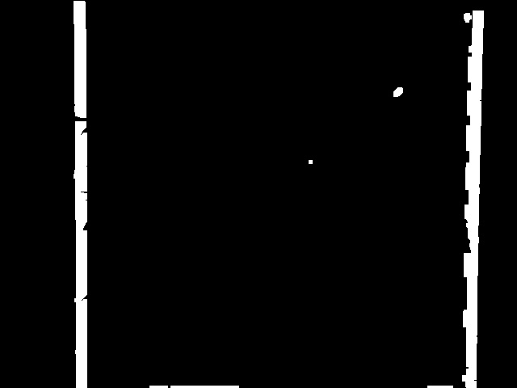
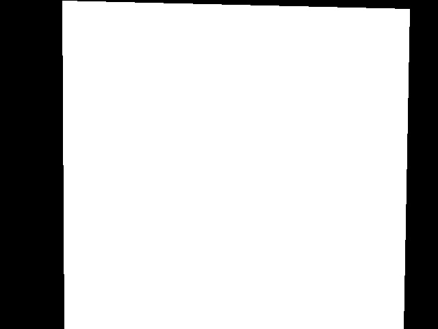
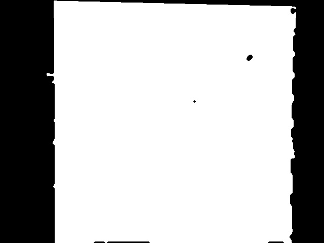
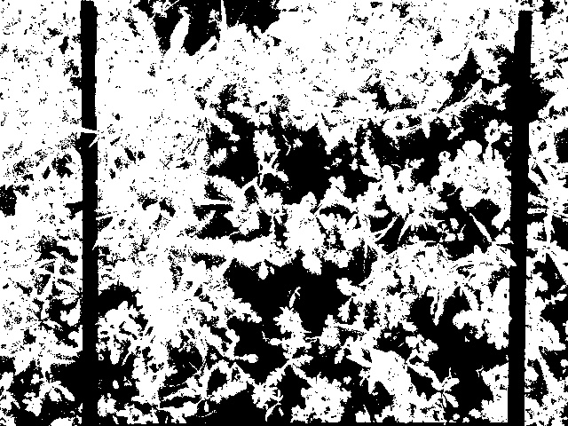
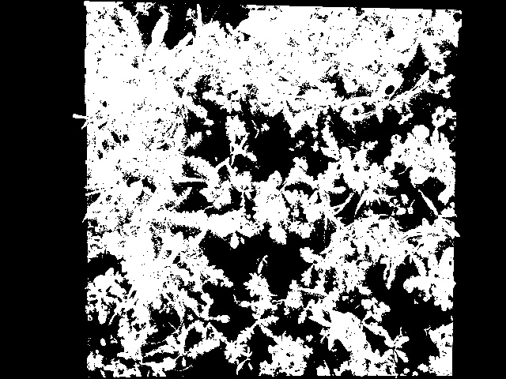

# Plant coverage analysis

The script processes a set of images and analyses the area covered by vegetation inside an area of interest.

## Running the script

Run the script passing the requried CLI arguments. For more info run the script with the `-h` flag.

```bash
coverage.py -s <source-dir or file> [-d <destination-dir>] [-l <limit>]
```

## Source Data

A source dataset image has these characteristics:

- Is a 4000x3000 pixel image
- Can be landscape or portrait orientation
- The area of interest is the area inside the white frame

<!--  -->


## Result Data

After analyzing an image a result image is created with these characteristics:

- Is a 640x480 pixel image
- Is in landscape orientation
- Shows only the area where vegetation is found inside the interest area 
- The vegetation coverage percentage is annotated in the upper-right corner

<!--  -->


Additionally a JSON formatted file is created containing the results of each processed image and statistical data for the whole set. Example:

```json
{
    "stats": {
        "count": 63,
        "average": 18.641420450467525,
        "std_dev": 5.979818628075384,
        "max": 30.531456202213455,
        "min": 5.7519336519379145
    },
    "processed_images": [
        {
            "image_filename": "20240514_103451.jpg",
            "coverage": 17.08461182399061
        },
        .
        .
        .
        {
            "image_filename": "20240514_103502.jpg",
            "coverage": 10.181409997727156
        }
    ]
}
```

## Coverage Calculation Process

### Area of Interest mask

The area of interest is the area inside the silver frame.

First, a mask is created to filter out everything that is not white, thus leaving only the silver frame used to denote the area of interest.



Second, a quadrilateral mask is created by calculating the position of the white pixels that are closest to the corners of the image and drawing a polygon with them. This new image is a mask that contains both the silver frame area and the area of interest. 



Third, the silver frame is removed from the quadrilateral mask. This provides a new mask which includes only the actual area of interest (the area inside the silver frame).



### Plants mask

Another masked is created based on the source image. This mask filters out everything that is not green, this is, everything that is not a plant.



### Final mask

Finally, a mask is created by combining the plants mask and interest area mask. 



The white pixels in this last mask make up for the space covered in plants inside the area of interest. 

The plant coverage is calculated as the ratio of the amount of white pixels in this mask over the amount of white pixels in the interest area mask.

### Result image

The source image and the final mask are combined to produce the result image. This result image contains only the areas which are covered in plants along with an annotation of the coverage value as a percentage.


## Analytics

There are several analysis that could be done given the nature and the source of the data. 

The data is given as images of segments of a field that is covered in plants. Each image is taken by locating a silver frame on the ground and taking a photo of the ground with the silver frame in the center, as can be seen in [Source Data](#source-data).

Given this we could keep track of the growth of plants on each segment of the field and then analyze two main aspects:
1. The difference in growth of an area of the field relative to another area of the field at the same point in time:
    - For example, if area #1 is known to be in the shadow most of the day and area #2 is known to be under the sun most of the day, then we can compare these two as a kind of "treatment".
    - See [unpaired t-test](https://datatab.net/tutorial/unpaired-t-test) for more info.
2. The difference in growth of the same area of the field at two different points in time:
    - For example, check if there was any significant growth between week 3 and week 4.
    - See [paired t-test](https://datatab.net/tutorial/paired-t-test) for more info.

Unfortunatelly the images provided in the dataset do not keep track of the segment of land they are taken from. The only reliable data from each image is the date and time when it was taken.

Two solutions are proposed:
- Change the name of the image file so it includes an id of the segment of land it corresponds to.
- Add a passive communication element (e.g: QR code) to each segment of land and make sure the element appears in the photo.

These two proposed solutions would allow us to identify the segment of land across datasets and, thus, make more and better analysis over the plants.


## Observations - WIP -

The full image is the original 4000x3000 image.
The small image is the resized 640x480 image.

When creating the mask to filter out non-greens this was noticed:

When using the full image to adjust the mask the HSV values used remained fairly the same as when using the small image.

However, with the full image the mask required an additional thresholding and morphology step to remove small particles that look like noise in the image. This is not required when using the small image as the small image looses a lot of details when resized.

