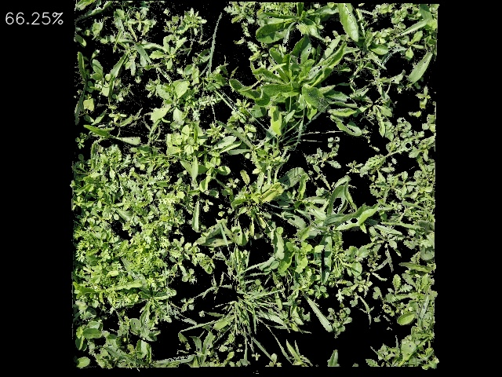

# Vegetation coverage analysis

The script processes a set of images and analyses the area covered by vegetation inside an area of interest.

## Running the script

Run the script passing the requried CLI arguments. For more info run the script with the `-h` flag.

```bash
coverage.py -s <source-dir or file> [-d <destination-dir>] [-l <limit>]
```

## Source Data

A source dataset image has these characteristics:

- Is a 4000x3000 pixel image
- Can be landscape or portrait orientation
- The area of interest is the area inside the white frame

<!--  -->


## Result Data

After analyzing an image a result image is created with these characteristics:

- Is a 640x480 pixel image
- Is in landscape orientation
- Shows only the area where vegetation is found inside the interest area 
- The vegetation coverage percentage is annotated in the upper-right corner

<!--  -->


Additionally a JSON formatted file is created with the results of each processed image and statistical data of the whole set:

```json
{
    "count": 84,
    "average": 56.10726570906062,
    "std_dev": 14.78754057685497,
    "max": 80.94714153010885,
    "min": 23.925361644228015,
    "processed_images": [
        {
            "source_image": ".../DataSet/coverage/240521_DW_84/20240521_113036.jpg",
            "result_image": ".../plant-coverage/coverage-results/20240521_113036.jpg",
            "coverage": 61.776393612302236
        },
        {
            "source_image": ".../DataSet/coverage/240521_DW_84/20240521_113044.jpg",
            "result_image": ".../plant-coverage/coverage-results/20240521_113044.jpg",
            "coverage": 61.54297410791534
        },
        {
            "source_image": ".../DataSet/coverage/240521_DW_84/20240521_113118.jpg",
            "result_image": ".../plant-coverage/coverage-results/20240521_113118.jpg",
            "coverage": 60.19040113201802
        }
    ]
}
```

## Observations - WIP -

The full image is the original 4000x3000 image.
The small image is the resized 640x480 image.

When creating the mask to filter out non-greens this was noticed:

When using the full image to adjust the mask the HSV values used remained fairly the same as when using the small image.

However, with the full image the mask required an additional thresholding and morphology step to remove small particles that look like noise in the image. This is not required when using the small image as the small image looses a lot of details when resized.

